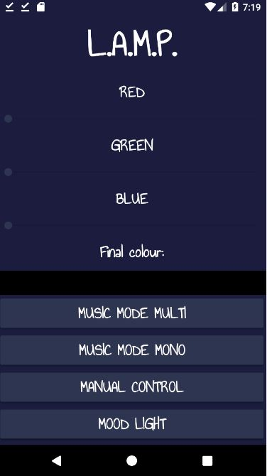
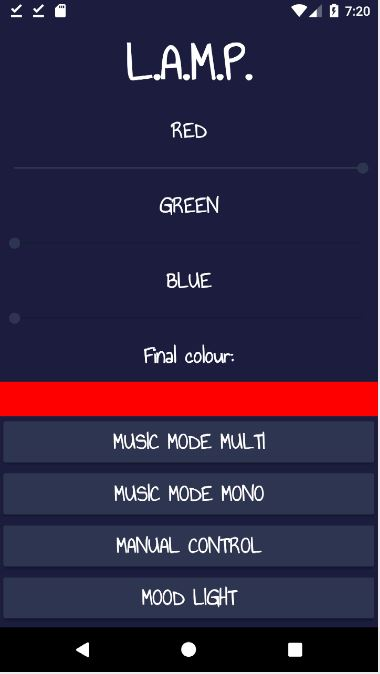
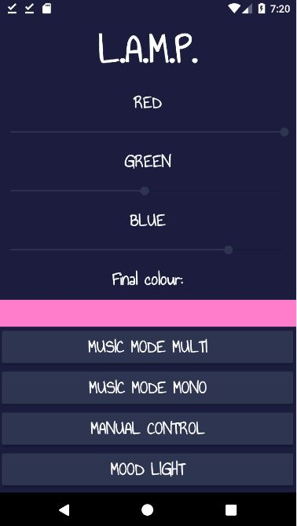

# L.A.M.P
BlueTooth Control App for sound reactive lights.

## Features
1) Active colour code feedback
2) Individual colour RGB value selection
3) Bluetooth connectivity

## Screenshots
1) Main Menu

2) Light Colour selection - 1

3) Light Colour selection - 2

